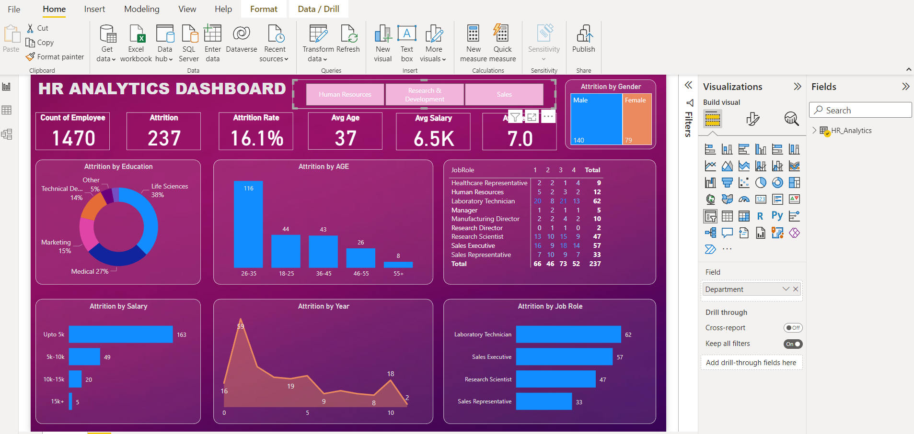

# HR Analytics Dashboard Project

## Introduction

The HR Analytics Dashboard project is dedicated to harnessing the capabilities of big data analysis to provide valuable insights into employee attrition and key performance indicators (KPIs). This dynamic dashboard aims to empower HR professionals with the ability to pinpoint the underlying causes of employee attrition, analyze trends across various departments, and ultimately make data-driven decisions to enhance employee retention.

## Problem Statement

Employee attrition is a significant challenge for organizations, often resulting from complex factors. Traditional methods of addressing attrition may fall short in providing comprehensive insights. The HR Analytics Dashboard project seeks to address this issue by employing advanced algorithms and data analysis techniques to identify patterns, correlations, and trends related to employee attrition. This project aims to provide HR professionals with the tools to proactively address attrition concerns and develop effective strategies.

## Skills

The development of the HR Analytics Dashboard project requires a combination of skills, including:

Data analysis and interpretation
Big data processing and manipulation
Algorithm implementation for pattern recognition
Data visualization and dashboard creation
Domain knowledge in human resources and employee management

## Data Sourcing

Data forms the foundation of this project. Gathering relevant and comprehensive data is crucial to obtaining accurate insights. Data will be sourced from HR records, employee surveys, performance evaluations, and other relevant sources. The quality and comprehensiveness of the data will directly impact the accuracy and effectiveness of the dashboard's insights.

## Data Transformation

Raw data often requires preprocessing and transformation to become suitable for analysis. The collected data will undergo cleaning, normalization, and structuring processes to ensure consistency and reliability. This transformed data will then be used for further analysis and visualization.

## Modeling Analysis & Visualizations

The heart of the HR Analytics Dashboard lies in its modeling and analysis components. Advanced algorithms will be applied to the transformed data to identify factors contributing to employee attrition. Patterns, correlations, and trends will be extracted to provide actionable insights. These insights will be translated into interactive visualizations, allowing HR professionals to comprehend complex data easily. Attrition rates over time and across departments, the identification of high attrition years, and department-wise insights will be prominently featured.

## Conclusion / Recommendation

The HR Analytics Dashboard project aims to revolutionize how organizations approach employee attrition and HR management. By offering data-driven insights, this project enables organizations to:

Understand and address the root causes of employee attrition
Strategically plan for improved employee retention
Make informed decisions based on real-time KPI monitoring
Optimize HR practices through enhanced efficiency and automation
Ultimately, the HR Analytics Dashboard project is poised to empower HR professionals with the tools they need to create a more engaged, satisfied, and productive workforce, driving organizational success.
